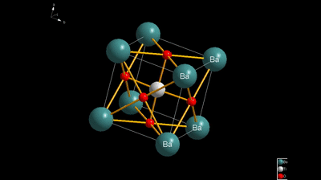
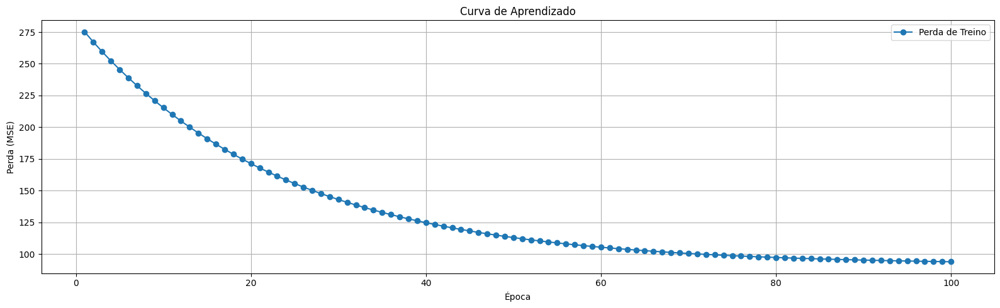

<h1 align="center">Modelagem Preditiva da Resposta Dielétrica de Perovskitas </h1>
<h2 align="center">🧠Redes Neurais Multicamadas</h2> 

  &nbsp;&bull;&nbsp; Perovskita 
  &nbsp;&bull;&nbsp; Redes Neurais
  &nbsp;&bull;&nbsp; Dielétrica
  &nbsp;&bull;&nbsp; Python

**Autores:** Ana Luz Pereira Mendes, Caio Matheus Leão Dantas e Rafael Anis Shaikhzadeh Santos

**Orientação:** Prof. Dr. Daniel R. Cassar

-----------

# ❓O que é peroviskta?
Perovskita é uma classe de materiais que apresentam propriedades de bastante destaque, como supercondutividade, ferroeletricidade, magnetorresistência e, mais recentemente, alto desempenho em células solares. A estrutura desses compostos são caracterizados por uma fórmula geral do tipo ABX3, em que "A" e "B" são cátions de diferentes tamanhos, enquanto "X" é um âncio  (geralmente oxigênio ou halogênio). 

  

# 🔬Por que prever a constante dielétrica?
A constante dielétrica (ε) é uma propriedade do material que mede sua capacidade de polarização quando exposto a um campo elétrico. Em outras palavras, trata-se da capacidade de um material formar dipolos elétricos internos em resposta ao campo externo.

Essa propriedade fundamental é muito importante na escolha de materiais para a fabricação de dispositivos eletrônicos. Em capacitores, uma constante dielétrica elevada significa maior capacidade de armazenamento de energia. Já em sensores, maior ε indica maior sensibilidade às variações de campo elétrico.

As perovskitas possuem constantes dielétricas elevadas, o que as torna materiais promissores para a composição desses dispositivos, especialmente em aplicações onde a precisão é crucial, como na bioeletrônica. Além disso, mesmo com pequenos estímulos, as perovskitas promovem grandes respostas estruturais e eletrônicas, aumentando ainda mais sua sensibilidade.

# ✅ Requisitos

<code>Requisitos</code> :

# 📚 Arquivos e Notebooks

<code>Notebook</code> :

<code>Fontes de dados</code> : https://datadryad.org/dataset/doi:10.5061/dryad.gq3rg

# 😄Conclusãos:

  

----------
# 👥Colaboradores
| [ Ana Luz Pereira Mendes](https://github.com/LuzMendes) [Ilum - CNPEM](https://ilum.cnpem.br/)  [Currículo Lattes](https://lattes.cnpq.br/4596466138573531) [Linkedin](https://www.linkedin.com/in/ana-luz-pereira-mendes/)|[ Caio Matheus Leão Dantas](https://github.com/Caiomld) [Ilum - CNPEM](https://ilum.cnpem.br/)  [Currículo Lattes](http://lattes.cnpq.br/8693036735970868)[Linkedin](https://www.linkedin.com/in/caio-matheus-le%C3%A3o-dantas/) | [ Rafael Anis Shaikhzadeh Santos ](https://github.com/drcassar)  [Ilum - CNPEM](https://ilum.cnpem.br/)  [Currículo Lattes](http://lattes.cnpq.br/1717397276752482) [Linkedin](https://www.linkedin.com/in/rafaelanis)| 
| :---: | :---: | :---: | 
