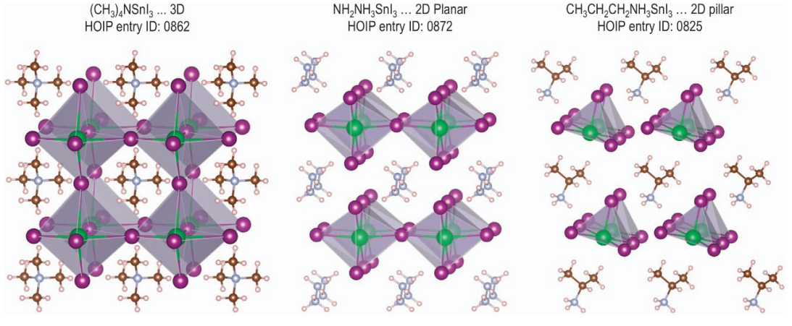

<h1 align="center">Modelagem Preditiva da Resposta Dielétrica de Perovskitas </h1>
<h2 align="center">🧠Redes Neurais Multicamadas</h2> 

  &nbsp;&bull;&nbsp; Perovskita 
  &nbsp;&bull;&nbsp; Redes Neurais
  &nbsp;&bull;&nbsp; Dielétrica
  &nbsp;&bull;&nbsp; Python

**Autores:** Ana Luz Pereira Mendes, Caio Matheus Leão Dantas e Rafael Anis Shaikhzadeh Santos

**Orientação:** Prof. Dr. Daniel R. Cassar

-----------
# ❓O que é peroviskta?

  

# 🔬Por que prever a constante dielétrica?
A constante dielétrica (ε) é uma propriedade do material que mede sua capacidade de polarização quando exposto a um campo elétrico. Em outras palavras, trata-se da capacidade de um material formar dipolos elétricos internos em resposta ao campo externo.

Essa propriedade fundamental é muito importante na escolha de materiais para a fabricação de dispositivos eletrônicos. Em capacitores, uma constante dielétrica elevada significa maior capacidade de armazenamento de energia. Já em sensores, maior ε indica maior sensibilidade às variações de campo elétrico.

As perovskitas possuem constantes dielétricas elevadas, o que as torna materiais promissores para a composição desses dispositivos, especialmente em aplicações onde a precisão é crucial, como na bioeletrônica. Além disso, mesmo com pequenos estímulos, as perovskitas promovem grandes respostas estruturais e eletrônicas, aumentando ainda mais sua sensibilidade.

# 🔬❓📌📚 Arquivos e Notebooks
<code>Notebook</code> 

----------
# Colaboradores

| :---: | :---: | :---: | 
